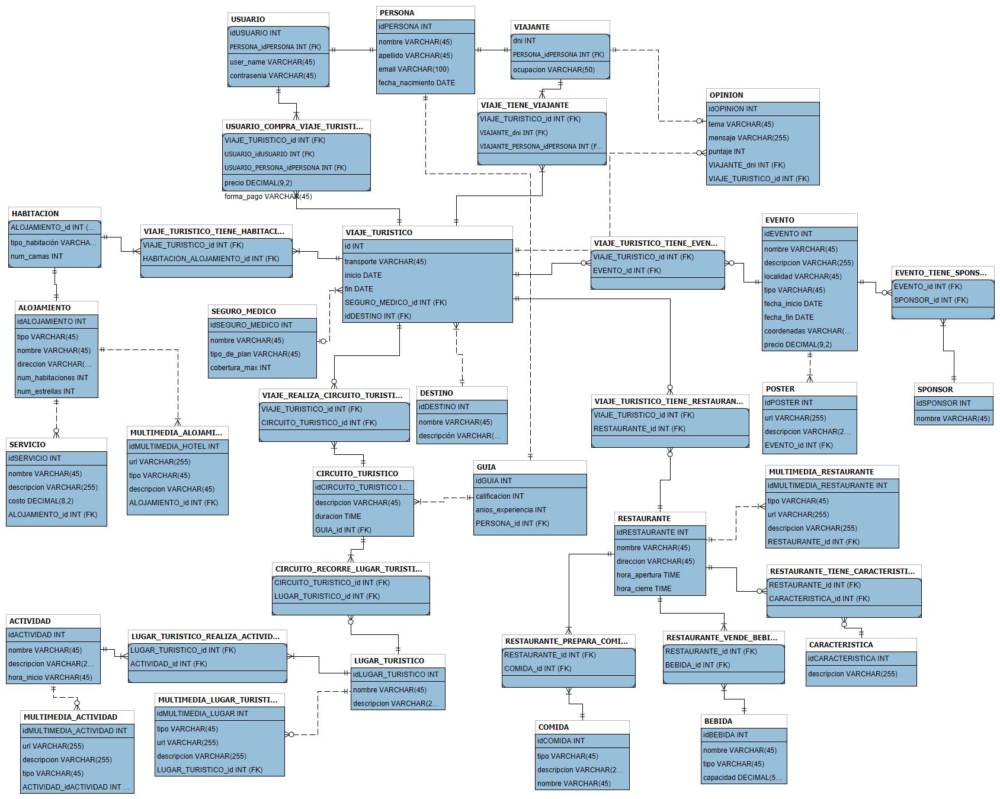

# TFI Base de Datos.

Proyecto final para la asignatura **Base de Datos** de la carrera Ing. en Computación UNT. 

Se pidió como consigna el diseño e implementación de una BD para una empresa de turismo. Además del diseño se crearon *stored procedures*, *views* y usuarios para el acceso a la misma.

El modelo final obtenido es el siguiente:

Luego se realizo una **API REST** en **Java** con **Spring Boot**, en base a consultas otorgadas por la cátedra, utilizando ***Spring Web*** para el manejo de las peticiones y ***JDBC***  para el acceso a la BD. También se un front-end para consumir la API y visualizar los datos.

---

## Proyecto
- Spring Boot 3
- JDK 21.
- Maven.
- Packaging: jar
---